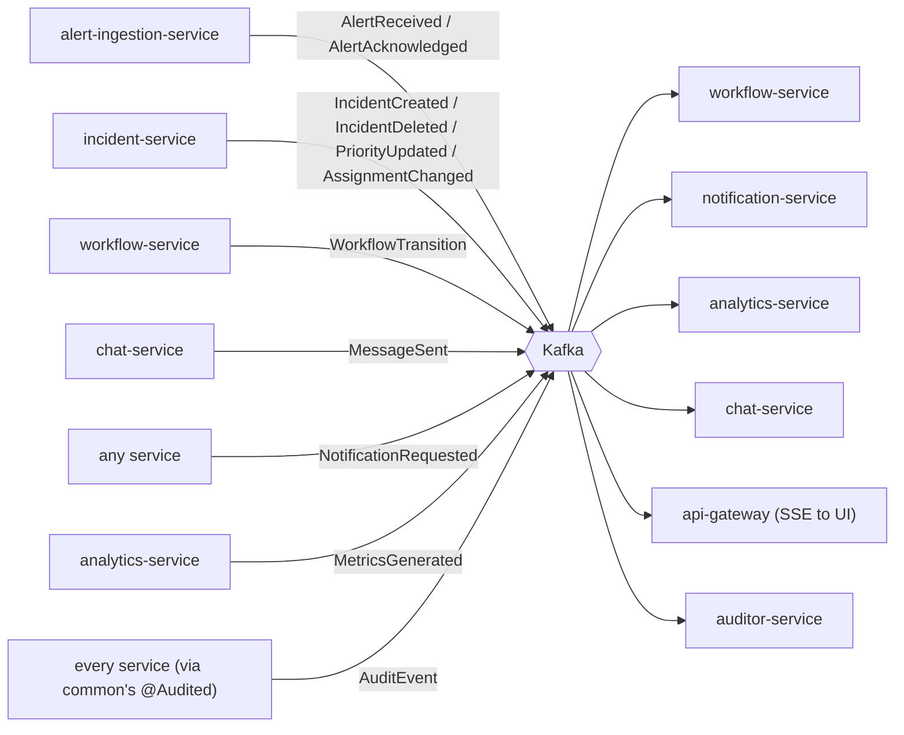

# Event flow

Full producer/consumer/payload table: [`services/common/EVENTS.md`](../../services/common/EVENTS.md).
This page is the visual summary.

## Cross-cutting cascade events

`OrgDeleted` and `UserMembershipRemoved` back the account/org-deletion cascade
described in the root README, §2:

- **`OrgDeleted`** — consumed by `incident-service`, `alert-ingestion-service`,
  `workflow-service`, `notification-service`, `chat-service`, `analytics-service`, and
  `auditor-service`, each bulk-deleting its own org-scoped rows.
- **`UserMembershipRemoved`** — consumed only by `user-service`, to soft-delete the
  affected directory row (so history still resolves the person's name).

## Guarantees

- Every event carries `orgId` (partition key) and an `eventId` for consumer-side
  idempotency.
- Producers set `acks=all`.
- Consumers run behind a shared `DefaultErrorHandler` (bounded retry + dead-letter
  topic, registered once in `services/common`) — a message that fails processing
  repeatedly is parked on `<topic>.DLT` after 3 attempts instead of blocking that
  partition for the whole consumer group.

See `services/common/EVENTS.md` for the idempotency-storage mechanism each consumer
uses (Postgres table, Mongo collection, or Redis key, depending on what the service
already owns).
