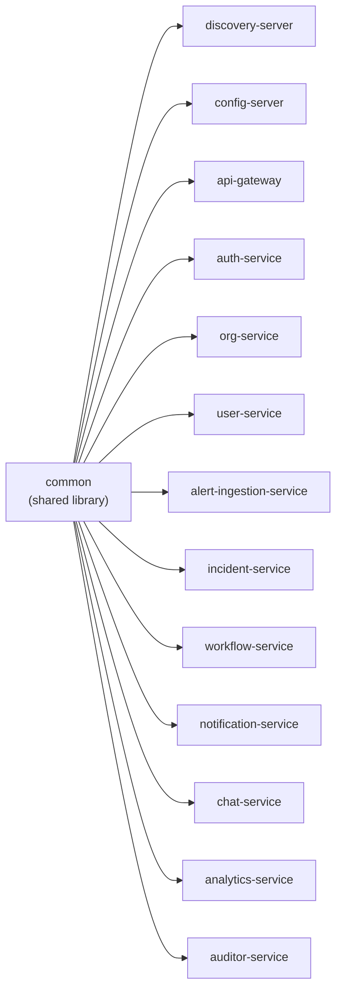

# Service architecture

## Services, ports, and databases

| # | Service | Port | Database | Notes |
|---|---|---|---|---|
| 1 | `discovery-server` (Eureka) | 8761 | — | Every other service registers here. |
| 2 | `config-server` (Spring Cloud Config) | 8888 | — | |
| 3 | `api-gateway` (Spring Cloud Gateway, WebFlux) | 8080 | — (Redis for rate limiting + session checks) | The only public entry point. |
| 4 | `auth-service` | 8091 | Postgres (`authdb`) + Redis | Identity, multi-org membership, invitations, sessions. |
| 5 | `org-service` | 8092 | Postgres (`orgdb`) | Tenant record + outbound webhook subscriptions. |
| 6 | `user-service` | 8093 | Postgres (`userdb`) | Per-org directory, Kafka-synced from `auth-service`. |
| 7 | `alert-ingestion-service` | 8094 | Mongo (`alertdb`) | HMAC-verified webhook ingestion. |
| 8 | `incident-service` | 8095 | Postgres (`incidentdb`) | Incident record + full timeline. |
| 9 | `workflow-service` | 8096 | Postgres (`workflowdb`) | Incident lifecycle state machine. |
| 10 | `notification-service` | 8097 | Mongo + Redis | In-app notifications + outbound webhook delivery. |
| 11 | `chat-service` | 8098 | Mongo + Redis | Per-incident chat, WebSocket. |
| 12 | `analytics-service` | 8099 | Mongo | Event-stream projection, MTTR metrics. |
| 13 | `auditor-service` | 8100 | Mongo | Sole consumer of the audit trail. |

`common` is a 14th Maven module — a shared library, not a runnable service.

## Module dependency shape

Every domain service registers with `discovery-server` (Eureka) and pulls config from
`config-server`. See the root [README](../../README.md), §9.1, for the per-service
internal package layout shared by every domain service.
