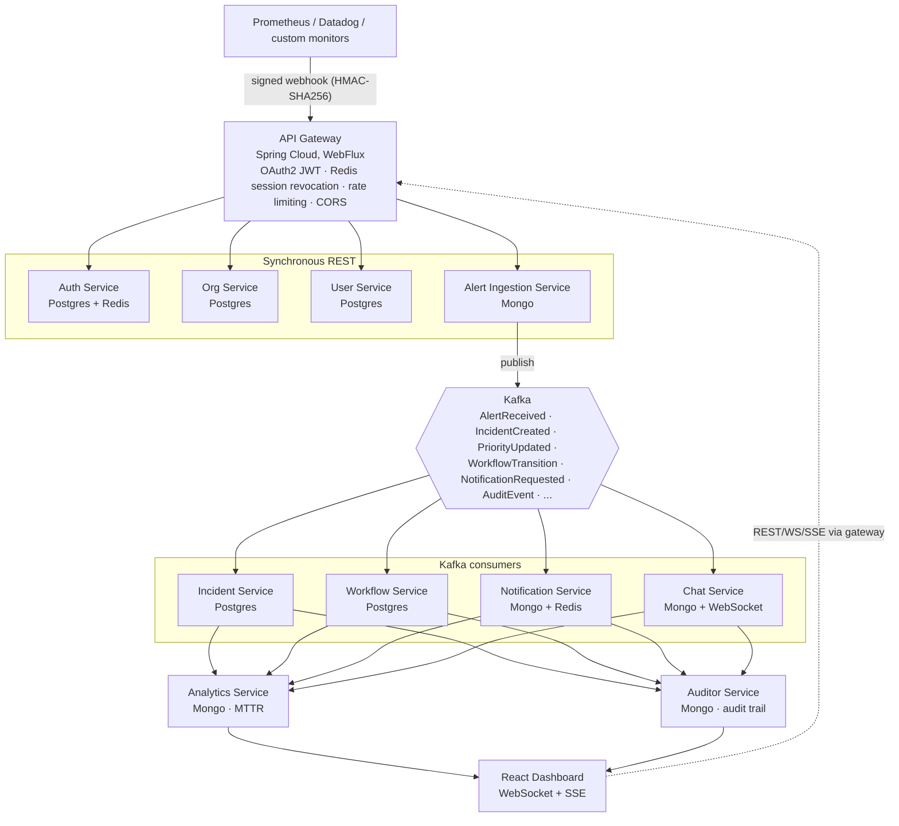

# System architecture

High-level request/event flow. See the root [README](../../README.md) for the full
write-up (security, multi-org membership, polyglot persistence, etc).

`discovery-server` (Eureka, port 8761) and `config-server` (Spring Cloud Config, port
8888) are pure infrastructure, registered by every service above but omitted from the
data-flow diagram for clarity — see [service-architecture.md](./service-architecture.md)
for the full service/port/database map.
